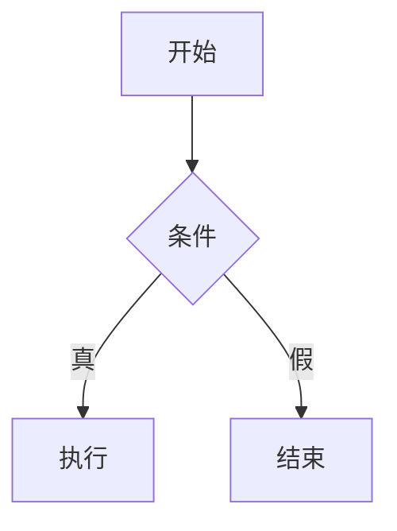

# 0 标题级别测试
# 一级标题 H1
你好
## 二级标题 H2
### 三级标题 H3
#### 四级标题 H4
##### 五级标题 H5
###### 六级标题 H6

---

## 1 段落与换行
这是一段普通的段落。  
行尾加两个空格即可硬换行（<br>）。

下面是一个空行分隔的新段落。

---

## 2 强调
*斜体星号*  
_斜体下划线_  
**加粗星号**  
__加粗下划线__  
***加粗斜体星号***  
~~删除线~~  
<kbd>Ctrl</kbd> + <kbd>C</kbd> 复制

---

## 3 列表
### 3.1 无序列表
- 苹果
- 香蕉
  - 青香蕉
  - 熟香蕉
* 星号列表
+ 加号列表

### 3.2 有序列表
1. 第一步
2. 第二步
   1. 子步骤 A
   2. 子步骤 B
3. 第三步

### 3.3 任务列表
- [x] 已完成任务
- [ ] 未完成任务
- [ ] 另一个待办

---

## 4 链接与图片
### 4.1 行内式
[百度一下](https://www.baidu.com "百度首页")

### 4.2 引用式
[Google][google]  
[google]: https://www.google.com "谷歌"

### 4.3 图片


---

## 5 代码
### 5.1 行内代码
调用 `printf("Hello\n");` 即可打印。

### 5.2 围栏代码块（带语言）
```js
// JavaScript
const add = (a, b) => a + b;
console.log(add(2, 3));
```

```cpp
// C++
#include <iostream>
int main() {
    std::cout << "Hello Markdown\n";
}
```

### 5.3 diff 高亮

```diff
- 删除行
+ 新增行
  上下文
```

---

## 6 表格


| 左对齐 | 居中 | 右对齐 |
| :----- | :--: | -----: |
| 苹果   |  2  |   ￥12 |
| 香蕉   |  3  |   ￥15 |

---

## 7 脚注

这里有个脚注[^note]。

[^note]: 我是脚注内容，可放链接或说明。是脚注内容，可放链接或说明。是脚注内容，可放链接或说明。是脚注内容，可放链接或说明。是脚注内容，可放链接或说明。是脚注内容，可放链接或说明。是脚注内容，可放链接或说明。是脚注内容，可放链接或说明。是脚注内容，可放链接或说明。是脚注内容，可放链接或说明。是脚注内容，可放链接或说明。是脚注内容，可放链接或说明。是脚注内容，可放链接或说明。是脚注内容，可放链接或说明。是脚==注内容，可放链接或说明。==是脚注内容，可放链接或说明。是脚注内容，可放链接或说明。是脚注内容，可放链接或说明。是脚注内容，可放链接或说明。是脚注内容，可放链接或说明。是脚注内容，可放链接或说明。是脚注内容，可放链接或说明。
    
---

## 8 缩写

HTML 是一种标记语言。
*[HTML]: HyperText Markup Language

---

## 9 定义列表

术语 1
:   定义 A

术语 2
:   定义 B

---

## 10 上下标

H~2~O 是水
x^2^ + y^2^ = z^2^

---

## 11 标记与高亮

==高亮文本==
++插入文本++
~~删除文本~~

---

## 12 自动链接

https://github.com
<user@example.com>

---

## 13 锚点跳转

[回到顶部](#0-标题级别测试)

---

## 14 Emoji

:smile: :heart: :rocket:

---

## 15 数学公式（需 MathJax/KaTeX）

行内 $a^2+b^2=c^2$
块级：

$$
\int_{-\infty}^{\infty} e^{-x^2}\,dx = \sqrt{\pi}
$$

---

## 16 Mermaid 图（需插件）



---

## 17 折叠详情

<details>
<summary>点我展开</summary>

这里可以嵌套任意块级元素，如：

- 列表项
- 代码块
- 表格

</details>

---

## 18 警告/提示（GitHub 风格）

> [!NOTE]
> 这是一条提示。

> [!WARNING]
> 这是一条警告。

> [!TIP]
> 这是一个提示。

> [!IMPORTANT]
> 这是重要信息。

> [!CAUTION]
> 这是警告信息。

---

## 19 注释（不可见）

[//]: #
---

## 20 换页（打印友好）

<div style="page-break-after: always;"></div>

---

## 21 嵌入 HTML

<p style="color: #0366d6;">可直接写原始 HTML，Markdown 不会干预。</p>

---

## 22 视频

<video controls width="100%">
  <source src="movie.mp4" type="video/mp4">
  您的浏览器不支持 video 标签。
</video>

---

## 23 音频

<audio controls>
  <source src="sound.ogg" type="audio/ogg">
  您的浏览器不支持 audio 标签。
</audio>

---

## 24 容器 & 样式（借助 HTML）

<div class="grid cards" markdown>

- 卡片 1
- 卡片 2
- 卡片 3

</div>

---

## 25 零宽空格（排版辅助）

中文与英文之间插入 `&#8203;` 可让渲染引擎更易断行。

---

## 26 混合示例：一段可直接用的 README 片段

```markdown
# 项目名


[](LICENSE)

> **Note**  
> 要求 Node.js ≥ 18

## 安装
```bash
npm i
```

## 特性

- [X]  极速构建
- [ ]  插件市场

## 截图


## 许可证

[MIT](./LICENSE) © 2024 Your Name

```

---

## 27 特殊符号与转义
\*不是斜体\*  
\`不是代码\`  
\\<br\\> 不会被解析为换行

---

以上 **27 大类**语法已覆盖 Markdown（GFM + 常用扩展）的几乎全部要素，可直接复制到本地文件 `all-in-one.md` 进行渲染测试。祝调试顺利！

