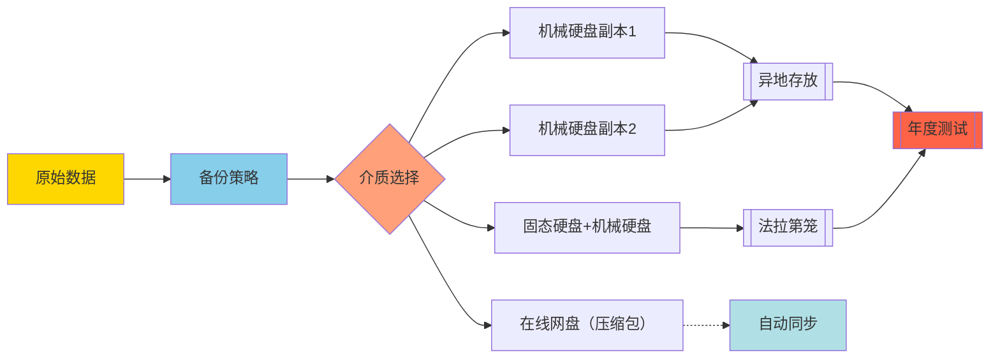
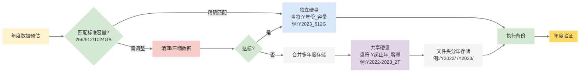
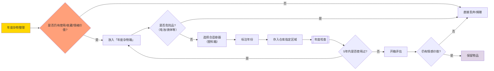

## 备份原则：

- **3份副本**：原始文件 + 2份备份
- **2种介质**：至少使用两种不同存储介质
- **1份在线**：至少1份备份在网盘
- **1份异地备份**（如不同城市的云存储）

### 存储介质选择与风险对比

| 介质类型     | 优点                 | 风险点                               |
| :----------- | :------------------- | :----------------------------------- |
| **机械硬盘** | 容量大、成本低       | 易物理损坏，尤其需要注意==抗震问题== |
| **固态硬盘** | 速度快、抗震         | 长期不通电可能丢数据                 |
| **NAS**      | 实时同步、多设备访问 | 需防范网络攻击                       |
| **蓝光光盘** | 寿命长               | 写入慢、容量有限                     |
| **云存储**   | 异地容灾、随时访问   | 依赖服务商稳定性                     |

## 详细执行规范：

这里需要备份的数据必须是==不常用==的，可能以后作回忆需要使用的数据，现在需要在==综合考虑成本==的情况下执行，于是得到下面的执行准则：

1. 两份副本使用同一种介质硬盘：机械硬盘；
2. 为了防止两份机械硬盘损坏，使用在线网盘备份一份；
3. 重要的数据使用两种不同的存储介质：固态硬盘+机械硬盘
4. 两份副使用异地备份的方式，防止一锅端。
5. 防EMP攻击：有条件的情况下将硬盘存放于法拉第笼（金属密封盒），ssd最容易因为这个损坏。
6. 定期测试：每年需要进行一次读取测试，及时发现问题。

## 文件备份系统

通常，一年的数据期望是对应一块硬盘的数据，这样利于管理。如果一年的数据刚刚好在256，512，1tb这种数据量下，则使用一块对应容量的硬盘，盘符标注年份。购买备份盘之前估计数据量，如果数据量可以刚刚好超过一点不多，以清理非必要数据为主（不存在过多的情况）。如果硬盘冗余存储空间过多，则使用一个盘存储多个年份的数据，盘符标注对应的年份，同时以文件夹分离开。

## 实体备份

对于一年中，总有我们已经用不到但是又舍不得扔的东西，但是我们通常也舍不得断舍离，诚然，如果家里是一套商品房，那没地方放杂物断舍离是应该的，但是有存放东西的地方，那么盲目断舍离是不可取的，所以以下内容在你有杂物仓库的情况下适用。

> 方案要做到既避免盲目断舍离，又防止仓库沦为垃圾场。

以一年为单位，使用一个合适的箱子（非纸箱）存放当年的非必要不使用的杂物，注意不存储包括电池、液体等不稳定物质。

---
