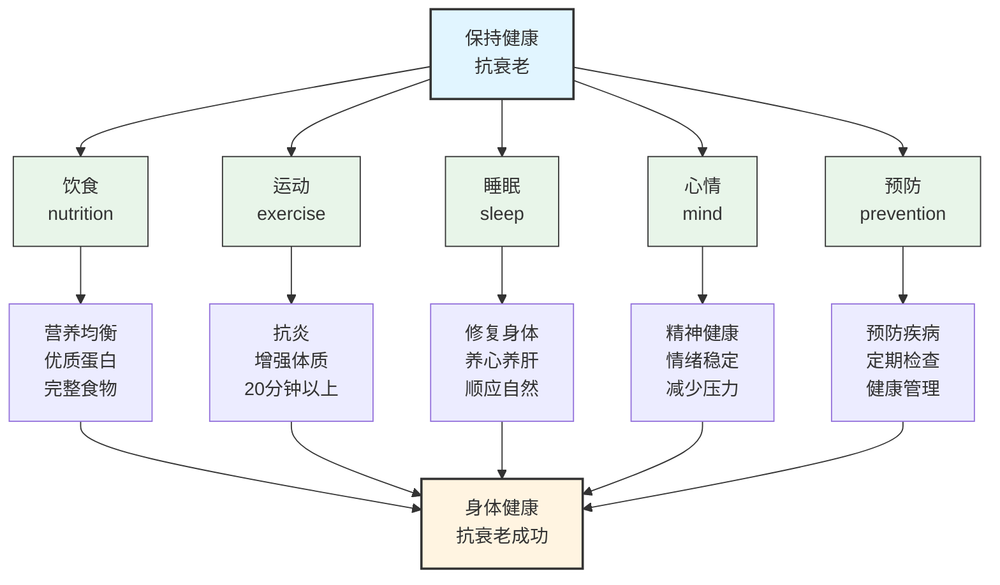

[保持健康]()[饮食]()[戒糖]()[如何计划有效戒糖？]()[优先选择“完整的食物”]()[优质蛋白质的摄入]()[油]()[中医食疗思路]()[补肾]()[虚劳的人如何补肾？]()[健脾]()[湿热体质的人的食谱:]()[三青汤(治疗脾胃湿热) :]()[或者可以熬粥:]()[运动]()[不要夜跑]()[受伤与疾病]()[早上起来脸浮肿]()[睡眠]()

# 保持健康

> **牛人都有强壮的身体，旺盛的精力，不管什么事业，最后拼的都是身体，保持健康才有机会，身体健康是一切的前提，此文章为个人健康理论思想蓝本，一切关于身体健康的实践与计划应出于此文章指导。**

**保持健康的中心点主要放在"抗衰老"上，抗衰老分为两大因素：身体年轻健康与精神健康，互为表里。不要忽视精神健康，忽略心情因素致命盲点。饮食、运动、睡眠、心情的质量，为健康与否的核心。本文关于中医西医的态度是开放、科学、务实，无论中医西医，对身体有益都是好医学。中西结合是趋势，也是未来。**

## 健康饮食大方向上尽量少摄入糖，多

> **样式多且均衡；食品包装营养表上 3 个越低越好: 钠 糖 反式脂肪。**

**健康饮食大方向上尽量少摄入糖，多吃优质蛋白，吃五谷杂粮。尽量保留食物原来的样子，减少加工的程度，多采用蒸、煮、快炒、烤等烹饪方法，减少油炸和红烧，这样可以保留更多营养，并控制不必要的油脂摄入。同时没有任何一种食物能提供全部营养。尽量让餐盘色彩丰富，不同颜色代表着营养全面的关键。**

**食品包装营养表上三个越低越好：钠、糖、反式脂肪酸。**

**以下为详细说明。**

### 戒糖

> **从营养角度来看，人类的食物中并不需要添加任何糖。🍬**

**戒糖的两个重要原因：**

1. **糖会与皮肤中的胶原蛋白发生“糖化反应”，导致皮肤失去弹性、产生皱纹和色斑。戒糖是性价比最高的“抗老”方式之一。**
2. **糖会诱发炎症，长期摄入过量糖分记忆力下降、认知功能减退，男性容易得阿尔茨海默病，女性卵巢早衰。**

#### 如何计划有效戒糖？

**原则上应该：不主动接触与购买含糖饮料，包括果汁和\*\***加工零食\*\*（饼干、蛋糕、冰淇淋）。

### 优先选择“完整的食物”

**蔬菜、水果、全谷物（如燕麦、糙米、藜麦）、豆类、坚果等种子类最为好，中医文化上吃能发芽的种子补肾气，生发之气。需要注意的是：小麦大麦等麸质**^常见麸质^食品促炎。

### 优质蛋白质的摄入

> **蛋白质是构建和修复身体组织的基础。**

**鱼、禽、蛋、瘦肉、豆制品（豆腐、豆浆）、奶制品。**

### 油

**一般来说，植物油中含有少量的天然反式脂肪酸，但这些反式脂肪酸并不会对人体健康产生负面影响。 然而，如果植物油经过氢化加工，就会形成人造反式脂肪酸。\*\***人造反式脂肪酸是一种不良脂肪酸，对人体健康有害。它干扰脂肪酸代谢，影响脂蛋白的形成，易造成血脂升高，增加患心血管疾病、糖尿病等疾病的风险。\*\* 因此，在购买植物油时，最好选择未经过氢化的植物油，如橄榄油、茶树油等，避免食用含有反式脂肪酸的植物油。此外，烹饪时也应该避免高温加热和反复使用，以减少反式脂肪酸的生成。

**以下是一些避免摄入反式脂肪的方法：**

1. **阅读食品标签：在购买加工食品时，应注意食品标签上的营养成分，如果含有反式脂肪，应尽量避免购买。**
2. **减少高温烹饪：高温烹饪会产生反式脂肪，因此应尽量减少炸、烤、煎等高温烹饪方式。**
3. **选择健康食品：选择新鲜、天然的食品，如蔬菜、水果、全麦面包、燕麦、豆类、鱼类等，这些食品不含反式脂肪。**
4. **减少油脂摄入：油脂是反式脂肪的主要来源，因此应尽量减少油脂的摄入量。**
5. **避免加工食品：加工食品通常含有反式脂肪，如薯片、饼干、糖果、冰淇淋等，应尽量避免食用。**
6. **适量摄入健康油脂：适量的健康油脂对身体有益，如橄榄油、亚麻籽油、芝麻油等，这些油脂含有健康的不饱和脂肪酸。**

## 中医食疗思路

### 补肾

**肾虚分阳虚阴虚，不可盲目。**

**补肾阳药通过加速“精化气”起效，本质是提前消耗精，仅适合确属阳虚且精未亏者；精已亏者再用就是透支。**

**补肾阴药提供高能量物质，但必须经过脾胃运化才能转化为精；运化不足时，其高能量反成负担，出现滋腻、碍脾、生湿。**

**临床常用的“补阴兼温阳”或“补阴兼健脾”法，仍需以阴液尚存、脏器无严重器质性衰退为前提；阴已竭或脏器老化者，同补亦无效，甚至加重阴耗。对阴精严重不足、运化无力者，最安全的是酸收类温性药（山萸肉、五味子等），通过减少阴精耗散实现“节流式”间接补充，用量须谨慎。**

#### 虚劳的人如何补肾？

> **虚劳的人脏器又有问题，运化不了补精药，又不能阴阳同补，也不能一边补精一边健脾，也不能受一点寒凉，胃不好，酸的也吃不了。那该如何补肾呢？**

**两种方法，一是\*\***补气血\*\*，精能化气化血，反过来气血收降也能化为精。但是精质重且厚，难补，而气血质轻而薄，相对好补，并且补了气血，这样精消耗的也就少了，自然而然可以多存一点。这也是间接的补了。

**第二是\*\***吃能留种的种子**，种子是真正的补精之品，植物把精华都给了下一代，也就是种子，这是自然规律，种子自己本身就是肾精。但是很多种植的药材自己都不能留种的，不能留种的种子，那吃它哪还有补精的作用呢？除了中药，食物更是如此。**要吃非转自留种的种子食物，最起码餐桌上要长期保证有两种，这类食物，如自由种的黄豆、土豆、大米等。\*\*减少转基因和抗生素肉、蛋等食物的摄入，这才是养生的根本方法。如果吃的食物只有形没有精来化气化血，药吃再多也是没用的。而且药现在又有多少是自留种的呢？并且药不能天天吃，食物却是天天吃的。

### 健脾

**脾主肌肉；**

**山药清蒸最好。**

### 湿热体质的人的食谱

**苦瓜 冬瓜 丝瓜 芹菜 竹笋 紫菜 海带 荠菜 赤小豆 绿豆 薏仁 梨子 马蹄 兔肉 鸭肉 绿茶 花茶**

**不能过多食用：麦芽糖 麦冬 蜂蜜 阿胶 银耳 雪蛤**

#### 三青汤(治疗脾胃湿热)

**丝瓜一条 , 苦瓜 1\~2 根 , 马齿苋 50 克 , 猪瘦肉 100 克 , 生姜三片 ,.**

1. **将丝瓜洗干净后去皮,切成滚刀块; 苦菊洗干净切成条状 ; 马齿苋洗干净放到沸水中烫一下 ; 猪肉切成薄片 ;**
2. **将锅至于火上,倒入少量植物油;**
3. **油温烧至五六成熟的时候放入肉片;**
4. **用铲子滑开,烧至颜色变白的时候倒入 400\~500 毫升清水,放入姜片,开大水煮沸 , 然后放入丝瓜;**
5. **开锅煮两三分钟之后 , 放入苦菊 , 马齿苋 继续煮半分钟 ;**
6. **最后煮熟放盐即可**

**一日一服 , 一天吃完**

#### 或者可以熬粥

**具体做法就是:**

**取 100 克的大米煮粥 ; 100 克的丝瓜洗干净切碎 ; 马齿苋洗干净放到沸水烫一下,切碎;**

**熬粥 20 分钟的时候 , 先放入丝瓜煮 2\~3 分钟,之后放入苦菊 , 马齿苋继续煮一分钟在放盐即可 .**

**同时马齿苋或苦菊可以煎汤洗脸**

**至少重复一个月**

---

## 运动

> **身体锻炼 20 分钟以上是有助于抗炎的**

1. **踮脚尖是一种有益于身体健康的运动。**
2. **身体锻炼 20 分钟以上是有助于抗炎的**

### 不要夜跑

**晚上是不宜运动的，人体的气血循环有其特定的时间规律，跑步最好在阳气最旺盛的上午进行。没有时间，也不要夜跑，宁可不跑也不要夜跑。感觉跑完之后会很舒服是因为气血循行起来了，气血循环是好事，但是夜间跑步会消耗身体本该储存的气血，导致身体脏器的休息和修复时间缩短，长期对身体有害。晚上跑步会导致身体消耗大，脏器无法得到休息，且容易流失津液，湿气重。跑步后洗澡会导致津液流失，进一步消耗气血。**

## 受伤与疾病

**病的源头有三种：**

1. **外来的，风；**
2. **内发的：喜怒忧思；**
3. **物理因素的外伤。**

**中医五行理论基础：**中医理论与中国哲学是理念相通的，总的来说就是五行的相生相克，八卦的物极必反，人要顺应自然，==人跟天地相通，治病应顺天地之道==。中医名词要去理解会发现往往都是一个“象”，可以简单理解为一个现象，就是非常朴素的一个形容，例如：寒极生热，热极生寒，这是人体的反应，是一个现象，也是中医的一个基本理论，并且有自成一套的理论依据。

> **阴阳可以无限分割。**

**为何从肝开始？肝为春为木，万物始发也，故肝木为开始。**

> **阳病治阴，阴病治阳。虚则补其母，母能令子虚，子能令母实。例如肝有问题，补土（脾），如果脾不行，就先健肾···以此类推。**

**东方应肝，南方为心脏，西方为肺北方为肾，中央为脾胃。**

**寒气生浊，热气生清；四肢为阳，身体内为阴；精吃气，形吃味；热伤气，寒伤血。**

**寒暑伤形，喜怒伤气，暴怒伤阴。**

**望：青黑痛，赤黄为热，白色为寒。**

**过食酸味伤脾，过咸伤骨，影响心脏，过甜伤肾，过苦伤胃。**

**心为阳中之阳，肺为阳中之阴；肾为阴中之阴，脾为阴中之阳，而人体以膈肌为界，分清浊，浊气在膈以下。**

**脉：左手为血脉，右手为气脉。**

---

**阳明头痛，浊气上升到头上眉间。**

> **春伤于风；夏伤于暑；秋伤于温；冬伤于寒。**

**阳气受损：眼睛看不见，五官功能衰退。阳受损，不容易止汗。**

**汗出见湿则生疣，汗出见寒则生疱化脓，运动流汗要马上擦干净，不要在皮肤上停留太久。**

**阳气不行（动），则阴累积，发为风疟，风为百病之始（来自于外面）**

**肺主皮毛，气伤则形肿；肝主筋，开窍于眼，酸疏肝。脾主肌，开窍于口，主口中津液。**

#### 早上起来脸浮肿

**风症，病因为冷气或电风扇对到脸上吹，使用祛风药。**

## 睡眠

> **顺应自然，调整作息时间，保持情情绪稳定，适当运动和享受自然环境。**

- **晚上 7 点到 9 点是养心的时间；**
- **21 点到 23 点是养阴阳的时间，这两个时间段是最好的入睡时间，晚上的 11 点尽量进入到睡眠状态；**
- **晚间 11 点到 1 点是胆经当令的时候，气血回收进入肝的，这个时间，是养血的时候；**
- **而后半夜 1 点到 3 点养肝的时候，肝来排毒。**

1. **春天时要晚睡早起，顺应自然规律，不要发脾气，要赏而勿罚；**
2. **夏天时要晚睡早起，享受阳光，即使很热，也要好好享受流汗散发浊气，夏天不发汗伤心脏 🫀 不要过于依赖空调等制冷设备；**
3. **秋天时要早睡早起，保持情情绪安宁，收敛神气，以顺应秋天的肃杀之气；**
4. **冬天时要早睡晚起，以顺应冬天的收藏之道；冬天出汗伤肾脏，导致肌肉萎缩精神不振。**

---

---

---

[**常见麸质**] \*\* **小麦制品（面包、面条、馒头、饼干、蛋糕）、大麦制品（啤酒、麦茶、麦片）、黑麦制品（黑麦面包）、酱油、豆瓣酱、蚝油、醋（非纯酿造）、香肠、火腿、肉丸、调味薯片、啤酒、奶茶粉、蛋糕、饼干、披萨、炸物面衣、咖喱块。**无麩质替代\*\*：大米、小米、玉米、荞麦、藜麦、土豆、红薯、木薯粉、杏仁粉、椰子面粉。

受伤与疾病

**病的源头有三种：**

1. **外来的，风；**
2. **内发的：喜怒忧思；**
3. **物理因素的外伤。**

**中医五行理论基础：**中医理论与中国哲学是理念相通的，总的来说就是五行的相生相克，八卦的物极必反，人要顺应自然，==人跟天地相通，治病应顺天地之道==。中医名词要去理解会发现往往都是一个“象”，可以简单理解为一个现象，就是非常朴素的一个形容，例如：寒极生热，热极生寒，这是人体的反应，是一个现象，也是中医的一个基本理论，并且有自成一套的理论依据。

> **阴阳可以无限分割。**

**为何从肝开始？肝为春为木，万物始发也，故肝木为开始。**

> **阳病治阴，阴病治阳。虚则补其母，母能令子虚，子能令母实。例如肝有问题，补土（脾），如果脾不行，就先健肾···以此类推。**

**东方应肝，南方为心脏，西方为肺北方为肾，中央为脾胃。**

**寒气生浊，热气生清；四肢为阳，身体内为阴；精吃气，形吃味；热伤气，寒伤血。**

**寒暑伤形，喜怒伤气，暴怒伤阴。**

**望：青黑痛，赤黄为热，白色为寒。**

**过食酸味伤脾，过咸伤骨，影响心脏，过甜伤肾，过苦伤胃。**

**心为阳中之阳，肺为阳中之阴；肾为阴中之阴，脾为阴中之阳，而人体以膈肌为界，分清浊，浊气在膈以下。**

**脉：左手为血脉，右手为气脉。**

---

**阳明头痛，浊气上升到头上眉间。**

> **春伤于风；夏伤于暑；秋伤于温；冬伤于寒。**

**阳气受损：眼睛看不见，五官功能衰退。阳受损，不容易止汗。**

**汗出见湿则生疣，汗出见寒则生疱化脓，运动流汗要马上擦干净，不要在皮肤上停留太久。**

**阳气不行（动），则阴累积，发为风疟，风为百病之始（来自于外面）**

**肺主皮毛，气伤则形肿；肝主筋，开窍于眼，酸疏肝。脾主肌，开窍于口，主口中津液。**

#### 早上起来脸浮肿

**风症，病因为冷气或电风扇对到脸上吹，使用祛风药。**

## 睡眠

> **顺应自然，调整作息时间，保持情情绪稳定，适当运动和享受自然环境。**

- **晚上 7 点到 9 点是养心的时间；**
- **21 点到 23 点是养阴阳的时间，这两个时间段是最好的入睡时间，晚上的 11 点尽量进入到睡眠状态；**
- **晚间 11 点到 1 点是胆经当令的时候，气血回收进入肝的，这个时间，是养血的时候；**
- **而后半夜 1 点到 3 点养肝的时候，肝来排毒。**

1. **春天时要晚睡早起，顺应自然规律，不要发脾气，要赏而勿罚；**
2. **夏天时要晚睡早起，享受阳光，即使很热，也要好好享受流汗散发浊气，夏天不发汗伤心脏 🫀 不要过于依赖空调等制冷设备；**
3. **秋天时要早睡早起，保持情情绪安宁，收敛神气，以顺应秋天的肃杀之气；**
4. **冬天时要早睡晚起，以顺应冬天的收藏之道；冬天出汗伤肾脏，导致肌肉萎缩精神不振。**

---

---

---

[**常见麸质**] \*\* **小麦制品（面包、面条、馒头、饼干、蛋糕）、大麦制品（啤酒、麦茶、麦片）、黑麦制品（黑麦面包）、酱油、豆瓣酱、蚝油、醋（非纯酿造）、香肠、火腿、肉丸、调味薯片、啤酒、奶茶粉、蛋糕、饼干、披萨、炸物面衣、咖喱块。**无麩质替代\*\*：大米、小米、玉米、荞麦、藜麦、土豆、红薯、木薯粉、杏仁粉、椰子面粉。
